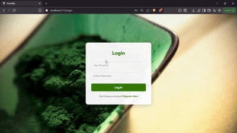
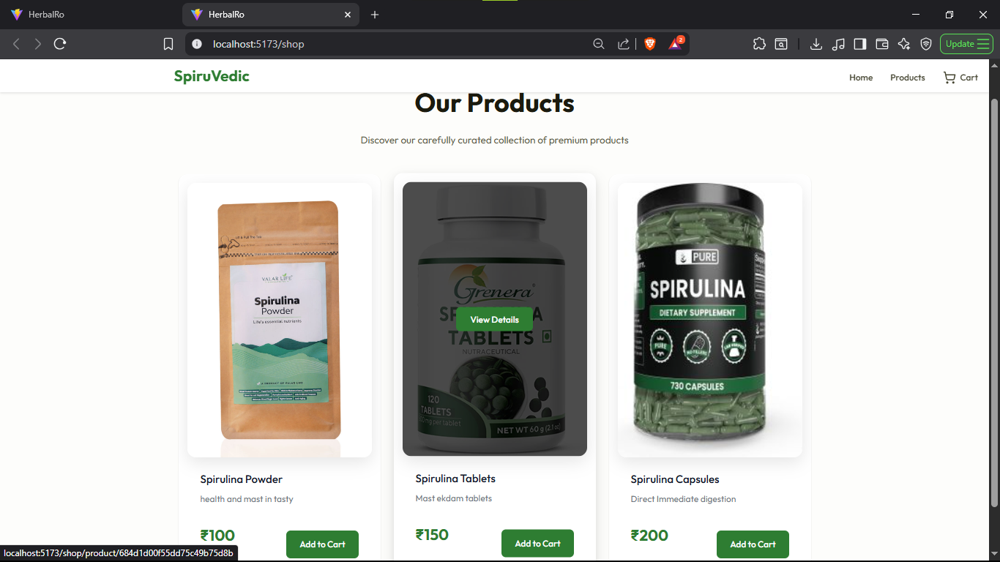
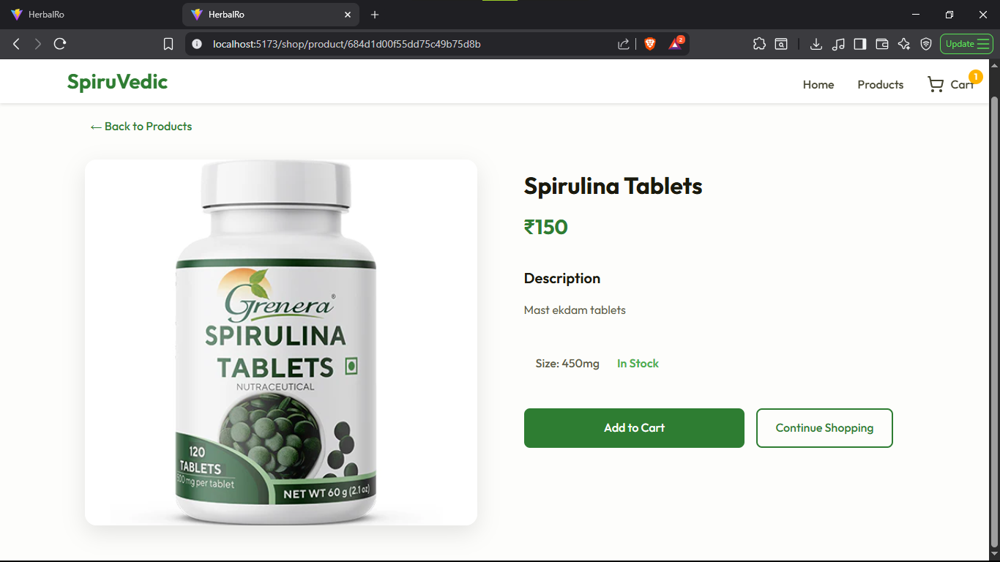
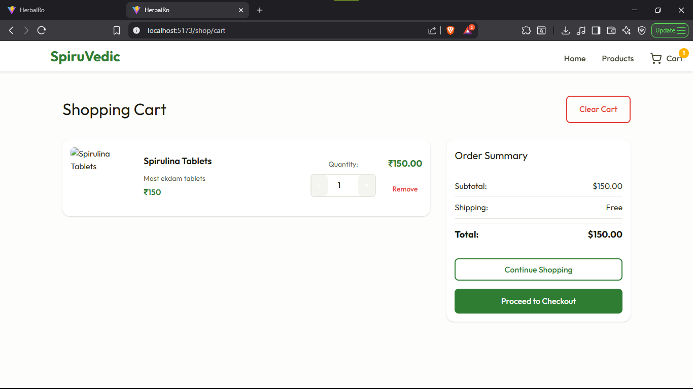
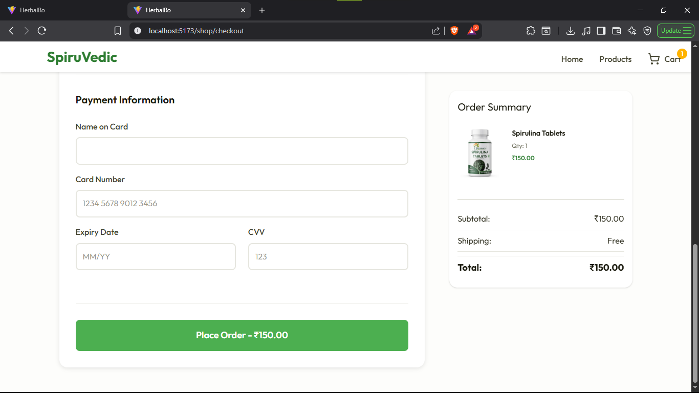

# 🛍️ eCommerce Web App — MERN Stack + Vite

---

A full-stack eCommerce web application built using the MERN stack (MongoDB, Express.js, React, Node.js), with **Vite** for lightning-fast frontend development. Features include **User authentication with JWT**, **bcrypt-secured login**, and **Admin dashboard** for managing website.

---

## 🎯 Features

- User registration & login (JWT auth)
- Redirect to page according to role
- Secure password handling with **bcrypt**
- Admin panel to manage:
  - Products
  - Orders
  - User roles
  - Shop Analytics
  - Review feedbacks
- MongoDB for data storage
- RESTful API using Cors, Express & Node.js
- React + Vite frontend

---

## 🛠️ Tech Stack

|     Frontend    |         Backend           | Database |     Auth       |
|-----------------|---------------------------|----------|----------------|
| React + Vite    | Node.js + Cors+ Express.js| MongoDB  | JWT + bcrypt   |


---

## Setup Instructions

### Prerequisites
- Node.js and npm
- MongoDB Atlas or local MongoDB instance

### Backend Setup
```bash
cd Server
npm install
npm start
```

### Frontend Setup
```bash
cd herbalro
npm install
npm run dev
```
---

## Environment Variables

To run this project, you will need to add the following environment variables to your .env.local file

- MONGODB_URL = your_mongodb_url
- jwt_secretKey = your_jwt_secret

---
##  Screenshots

**Here is a preview of the application:**

<p float="left">
  
  
</p>

**Admin/Moderator Page:**

<p float="left">
  
  Admin Login:

  

  
  Moderator Login:
  
  

  
  
  
</p>

**Shop Page:**

<p float="left">
  
  
  
  
</p>

---
## Status
- Completed core features
- Actively testing and refining
- Future plans: Payment Integration

--- 

## Author
- [@PriteshET](https://github.com/PriteshET)
